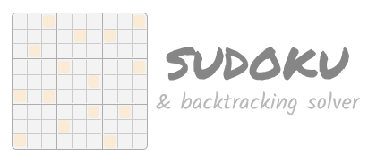
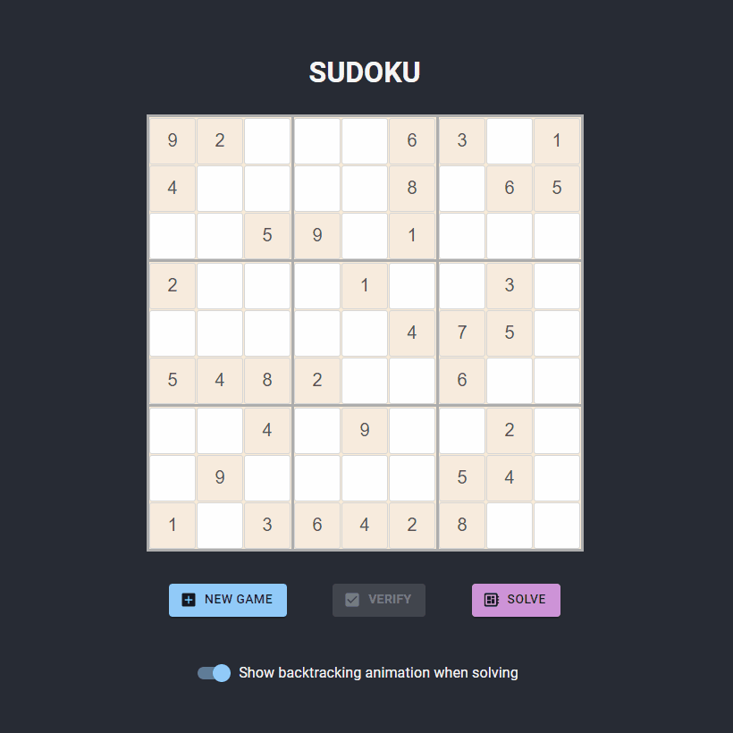

<div align="center">
    
</div>

<div align="center">


</div>

---

## 📘 Overview

This mini-project is to demonstrate how the backtracking algorithm can be used to solve a problem (with multiple contraints) like Sudoku. In the case of Sudoku numbers cannot repeat in a row, column or mini-grid

The process of trying possible candidates to the solution and backtracking as soon as it determines that the candidate cannot possibly be completed to a valid solution, is visible via the animation of solving.

[Learn more in Wikipedia](https://en.wikipedia.org/wiki/Backtracking)

## 🚀 Preview

<p align="center" width="100%">
    
</p>

## 🛠️ Installation Steps

1.  Clone the repository

```bash
git clone https://github.com/Yathu2007/sudoku.git
```

2.  Change the working directory

```bash
cd .\sudoku\
```

3.  Install dependencies

```bash
npm install
```

4.  Run the app

```bash
npm start
```

🌟 You are all set!

## 💻 Built with

-   [React JS](https://reactjs.org/)
-   [Material UI](https://mui.com/) - for styling
